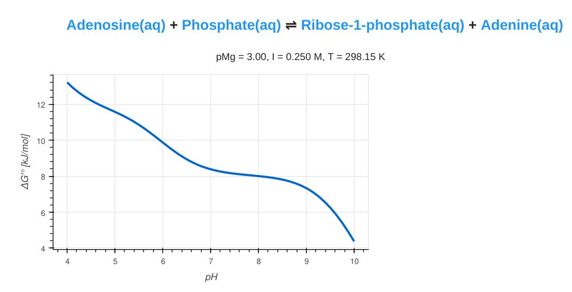
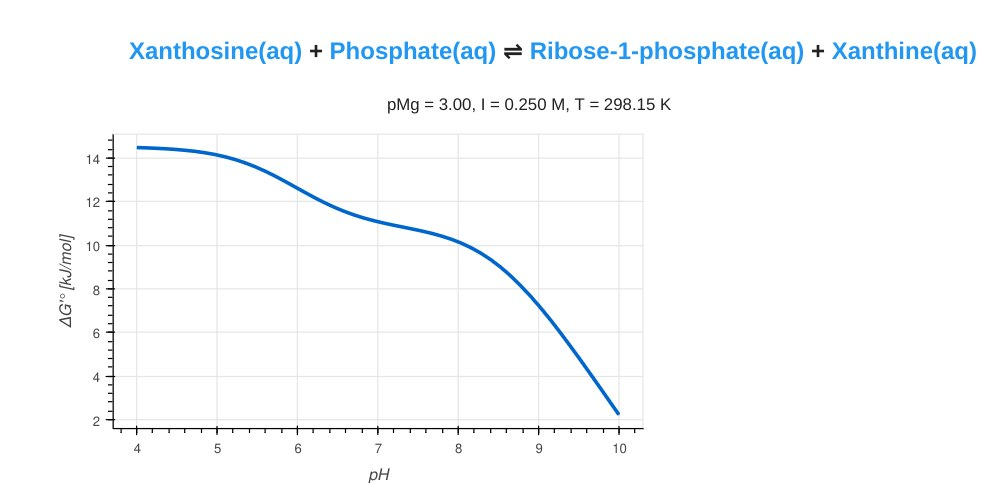
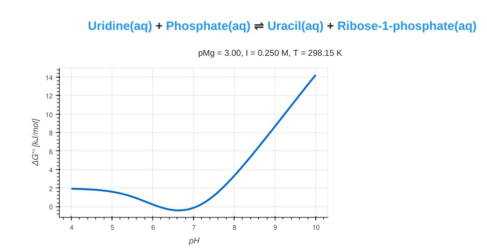
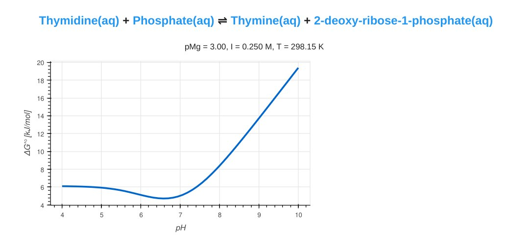
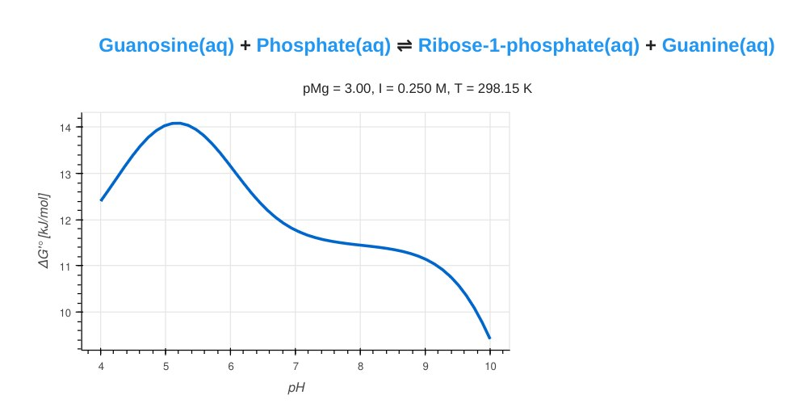
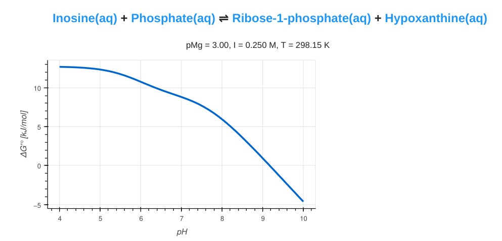

- start 5:35
- looking into eQuilibrator predictions for pH sensitivity of nucleoside phosphorolysis reactions:
	- Ado + P = Ade + Rib1P
		- 
		- [link](https://equilibrator.weizmann.ac.il/graph_reaction?p_h=7.5%20dimensionless&p_mg=3.0%20dimensionless&ionic_strength=0.25%20molar&temperature=298.15%20kelvin&e_potential=0%20volt&reactantsId=200&reactantsName=Adenosine&reactantsCoeff=-1&reactantsPhase=aqueous&reactantsAbundance=1.0&reactantsAbundanceUnit=millimolar&reactantsId=12&reactantsName=Phosphate&reactantsCoeff=-1&reactantsPhase=aqueous&reactantsAbundance=1.0&reactantsAbundanceUnit=millimolar&reactantsId=281&reactantsName=Ribose-1-phosphate&reactantsCoeff=1&reactantsPhase=aqueous&reactantsAbundance=1.0&reactantsAbundanceUnit=millimolar&reactantsId=160&reactantsName=Adenine&reactantsCoeff=1&reactantsPhase=aqueous&reactantsAbundance=1.0&reactantsAbundanceUnit=millimolar&vary_ph=1)
	- Xao + P = Rib1P + Xan
		- 
		- [link](https://equilibrator.weizmann.ac.il/graph_reaction?p_h=7.5%20dimensionless&p_mg=3.0%20dimensionless&ionic_strength=0.25%20molar&temperature=298.15%20kelvin&e_potential=0%20volt&reactantsId=652&reactantsName=Xanthosine&reactantsCoeff=-1&reactantsPhase=aqueous&reactantsAbundance=1.0&reactantsAbundanceUnit=millimolar&reactantsId=12&reactantsName=Phosphate&reactantsCoeff=-1&reactantsPhase=aqueous&reactantsAbundance=1.0&reactantsAbundanceUnit=millimolar&reactantsId=281&reactantsName=Ribose-1-phosphate&reactantsCoeff=1&reactantsPhase=aqueous&reactantsAbundance=1.0&reactantsAbundanceUnit=millimolar&reactantsId=165&reactantsName=Xanthine&reactantsCoeff=1&reactantsPhase=aqueous&reactantsAbundance=1.0&reactantsAbundanceUnit=millimolar&vary_ph=1)
	- Urd + P = Rib1P + Ura
		- 
		- [link](https://equilibrator.weizmann.ac.il/graph_reaction?p_h=7.5%20dimensionless&p_mg=3.0%20dimensionless&ionic_strength=0.25%20molar&temperature=298.15%20kelvin&e_potential=0%20volt&reactantsId=274&reactantsName=Uridine&reactantsCoeff=-1&reactantsPhase=aqueous&reactantsAbundance=1.0&reactantsAbundanceUnit=millimolar&reactantsId=12&reactantsName=Phosphate&reactantsCoeff=-1&reactantsPhase=aqueous&reactantsAbundance=1.0&reactantsAbundanceUnit=millimolar&reactantsId=150&reactantsName=Uracil&reactantsCoeff=1&reactantsPhase=aqueous&reactantsAbundance=1.0&reactantsAbundanceUnit=millimolar&reactantsId=281&reactantsName=Ribose-1-phosphate&reactantsCoeff=1&reactantsPhase=aqueous&reactantsAbundance=1.0&reactantsAbundanceUnit=millimolar&vary_ph=1)
	- Thd + P = dRib1P + Thy
		- 
		- [link](https://equilibrator.weizmann.ac.il/graph_reaction?p_h=7.5%20dimensionless&p_mg=3.0%20dimensionless&ionic_strength=0.25%20molar&temperature=298.15%20kelvin&e_potential=0%20volt&reactantsId=399&reactantsName=Thymidine&reactantsCoeff=-1&reactantsPhase=aqueous&reactantsAbundance=1.0&reactantsAbundanceUnit=millimolar&reactantsId=12&reactantsName=Phosphate&reactantsCoeff=-1&reactantsPhase=aqueous&reactantsAbundance=1.0&reactantsAbundanceUnit=millimolar&reactantsId=366&reactantsName=Thymine&reactantsCoeff=1&reactantsPhase=aqueous&reactantsAbundance=1.0&reactantsAbundanceUnit=millimolar&reactantsId=983&reactantsName=2-deoxy-ribose-1-phosphate&reactantsCoeff=1&reactantsPhase=aqueous&reactantsAbundance=1.0&reactantsAbundanceUnit=millimolar&vary_ph=1)
	- Guo + P = Rib1P + Gua
		- 
		- [link](https://equilibrator.weizmann.ac.il/graph_reaction?p_h=7.5%20dimensionless&p_mg=3.0%20dimensionless&ionic_strength=0.25%20molar&temperature=298.15%20kelvin&e_potential=0%20volt&reactantsId=380&reactantsName=Guanosine&reactantsCoeff=-1&reactantsPhase=aqueous&reactantsAbundance=1.0&reactantsAbundanceUnit=millimolar&reactantsId=12&reactantsName=Phosphate&reactantsCoeff=-1&reactantsPhase=aqueous&reactantsAbundance=1.0&reactantsAbundanceUnit=millimolar&reactantsId=281&reactantsName=Ribose-1-phosphate&reactantsCoeff=1&reactantsPhase=aqueous&reactantsAbundance=1.0&reactantsAbundanceUnit=millimolar&reactantsId=246&reactantsName=Guanine&reactantsCoeff=1&reactantsPhase=aqueous&reactantsAbundance=1.0&reactantsAbundanceUnit=millimolar&vary_ph=1)
	- Ino + P = Rib1P + Hyp
		- 
		- [link](https://equilibrator.weizmann.ac.il/graph_reaction?p_h=7.5%20dimensionless&p_mg=3.0%20dimensionless&ionic_strength=0.25%20molar&temperature=298.15%20kelvin&e_potential=0%20volt&reactantsId=316&reactantsName=Inosine&reactantsCoeff=-1&reactantsPhase=aqueous&reactantsAbundance=1.0&reactantsAbundanceUnit=millimolar&reactantsId=12&reactantsName=Phosphate&reactantsCoeff=-1&reactantsPhase=aqueous&reactantsAbundance=1.0&reactantsAbundanceUnit=millimolar&reactantsId=281&reactantsName=Ribose-1-phosphate&reactantsCoeff=1&reactantsPhase=aqueous&reactantsAbundance=1.0&reactantsAbundanceUnit=millimolar&reactantsId=201&reactantsName=Hypoxanthine&reactantsCoeff=1&reactantsPhase=aqueous&reactantsAbundance=1.0&reactantsAbundanceUnit=millimolar&vary_ph=1)
-
- Searching for example LDH assay conditions:
	- https://doi.org/10.1590/S0100-879X1997000300012
		- "The reaction medium for LDH activity contained 20 mM imidazole-HCl 
		  buffer, pH 7.5, 1 mM EDTA, 160 µM NADH, 1 mM pyruvate and 20 µl of the 
		  supernatant."
	- SIGMA QUALITY CONTROL TEST PROCEDURE "Enzymatic Assay of L -LACTIC DEHYDROGENASE", e.g. at https://www.sigmaaldrich.com/deepweb/assets/sigmaaldrich/product/documents/303/444/l3757enz.pdf
		- 100 mM Sodium Phosphate Buffer, pH 7.5 , 0.13x(28/30) mM NADH, 69x(1/30) mM Pyruvate
			- stock solutions: 0.13mM NADH, 69mM pyruvate; use 2.8mL NADH, 0.1mL pyruvate stock solution, add 0.1mL of 0.5 U/mL LDH solution