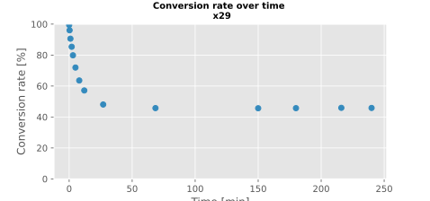
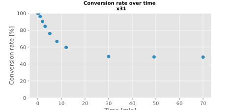

- test reaction:
	- prepare quench eppis:
		- add 500uL #x5 naoh to each
	- design mixture:
		- 2mM nucleoside, 10 mM phosphate, 50 mM buffer, 10 ug/ml enzyme
		- prepare #x29:
			- 100ul #x24 uridine, 50ul #x26 phosphate
			- 349uL #x14 tris
			- put eppi into thermoblock @37°C, no shaking, let pre-heat from 9.40h
			- take t0 sample at 9.47h into quench eppi (transfer 30uL)
			- add 1.1 uL #x21 enzyme
		- timepoint start: 10.00h
		- take samples directly into 500uL NaOH; 30uL samples
		- timepoints:
			- t1: 20 seconds
			- t2: 1 min 5 seconds
			- t3: 2.00min
			- t4: 3.00min
			- t5: 5.00min
			- t6: 8.00min
			- t7: 12.00min
			- t8: 27.00min
			- t9: 1h 8min 30s
			- t10: 2h 30min
			- t11: 3h 0min
			- t12: 3h 36min == 216 minutes
			- t13: 4h 00min == 240 minutes
	- measure in #cary300; UV/Vis campaign RTG6
		- air path only => 2024-08-17-air-1
		- cuvette with water =>2024-08-17-cuvette-water-2
		- cuvette with #x5 naoh blank => 2024-08-17-cuvette-blank-x5-naoh-3
		- t0 =>2024-08-17-RTG6-x29-t0-4
		- t1 to ... => 2024-08-17-RTG6-x29-t*...
		- 
		- => conclusion: equilibrium reached after approx 60 min; conversion approx 54%
	-
-
- prepare #x30 universal buffered reaction solution
	- recipient: 50 mL falcon tube, tara 12.84g empty, 12.8401 on analytical scale
	- with weighing paper, try:
	- actual: 0.0435 g citrate (intended: 44.1 mg)
	- actual: 0.0359 g hepes (intended: 35.7 mg)
	- actual: 0.0196 g taurin (intended: 18.8 mg)
	- actual: 0.0167 g proline (intended: 17.3 mg)
	- actual: 0.0705 g phosphate (intended: 68.5 mg)
	- actual: 0.0146 g uridine (intended: 14.7 mg)
	- weigh recipient: now 13.05g
	- add pre-warmed h2o up to 36.31g (filled with approx 25 mL)
	- hold to temperature on heating plate while adjusting the pH
	- measure pH = 7.41 @ 31.8°C
	- weigh recipient: now 36.21g (lost 0.02g while measuring pH => acceptable)
	- add more h2o to 43.07g (== 30.04g)
	- measure pH: 7.43 @ 31.1°C
	- pH: 7.39 @ 32.8 °C
	- 12h31: take 500uL => #x31
	- pH: 7.37 @ 35.1 °C
	- pH: 7.35 @ 37.3 °C
	-
	-
- cary300 RTG7, #x31 :
	- sample t0, without any addition
	- 12h32: start pre-heat at 37°C
	- 12h47: add 1.1 uL #x21 enzyme
	- timepoints:
	- t1: 20 seconds
	- t2: 1min
	- t3: 2min
	- t4: 3min 6 sec
	- t5: 5min 6sec
	- t6: 8min 6sec
	- t7: 12min
	- t8: 30min
	- t9: 49min 15sec
	- t10: 1hour 10min == 70 minutes
	- 
	- => conclusion: equilibrium reached at approx 30 minutes; approx 51% conversion
- store #x30 in 4°C fridge
