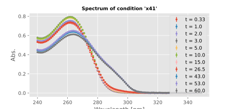

- take #x30 out from 4°C fridge. observation: solidified content. put to 37°C water bath. liquifies again.
- prepare #x32:
	- fill 500uL #x30 into eppi
	- start pre-heating at 37°C in eppendorf shaker at 8.20h
	- 10:48 add 3uL #x21 enzyme
	- sample 30ul #x32 to 500ul #x33-naoh at the following timepoints:
		- t0 = 12 seconds
		- t1 = 1 min
		- t2 = 2 min
		- t3 = 3 min
		- t4 = 4 min
		- t5 = 5 min
		- t6 = 10 min
		- t7 = 15 min 12 seconds
		- t8 = 20 min
		- t9 = 25 min
		- t10 = 11:52 ==64 min
		- t11 = 13:25 == 157 min
		- ```calc
		  120 + 60-48+25
		  ```
	- measure in #cary300-RTG9:
	- blank water => -blank-water-1
	- t0..t6 => -x32-t*
	- blank water => -blank-water-9
	- t7 => -x32-t7-10
	- t8 = -11
	- t9 => -12
	- => x32-t10-32
	- water only => -blank-water-33
	- DONE RTG10/2024-09-01-RTG10-x32-t11-15
	- 
	- => equilibrium reached after approx 20 min; conversion / yield = approx 51 %
	-
- prepare #x33-naoh:
	- identify #stock-naoh-vwr
		- supplier VWR
		- article # 28248.298 , 1 kg
		- LOT 11D120014
		- purity >99.5% , Ph.Eur. quality
	- 250ml schott bottle, tara glass including pouring ring: 223.57g
	- add 0.84g naoh pastilles #stock-naoh-vwr to bottle
	- ```calc
	  .84/.8*200
	  ```
	- add 209.94g millipore water
	- label as "x33 RTG 2024-09-01 0.1M NaOH"
	- dissolve pastilles by regular swirling
- prepare #x34-kcl:
	- identify #stock-kcl-roth:
		- supplier Carl Roth
		- article number 6781.1 , 1 kg
		- lot 368274214
		- quality: >99.5%, p.a. ACS ISO
		- mw 74.56 g/mol
	- 100ml schott bottle, tara glass including pouring ring: 152.24g
	- ```calc
	  1.56/74.56*1000
	  ```
	- add 1.56g #stock-kcl-roth to bottle
	- add 20.92g water
	- label as "x34 RTG 2024-09-01 1M KCl"
- 09:19 : measure pH of #x30:
	- 7.42 @ 35.0°C
	- 09:37 after re-calibration: 7.38 @ 32.4°C
	- 09:39 7.36 @ 33.4°C
	- 09:45 7.40 @ 34.4°C
	- 7.37 @ 35.1°C
	- 7.38@ 35.1°C
	- 7.37 @ 35.3°C
	- 14:00
	- pH 7.36 @ 37.5C
- prepare #x35:
	- 15 ml falcon tube
	- fill with 2 mL (2x1000uL) #x30
	- add 2 mL water (2x1000uL)
	- let equilibrate temperature in water bath
	- measure pH
	- 09:39 7.39 @ 34.3°C
	- 7.40 @ 34.6°C
	- 7.37 @ 34.4°C
	- 7.37 @ 34.5°C
	- 7.38 @ 34.5°C
	- => conclusion: dilution did not change pH
	-
- prepare #x36:
	- 15 ml falcon tube
	- fill with 2 mL (2x1000uL) #x30
	- add 2 mL #x34-kcl (2x1000uL)
	- let equilibrate temperature in water bath
	- measure pH
	- 09:43 7.14 @ 34.0°C
	- 7.17 @ 34.1°C
	- 7.17 @ 34.4°C
	- 7.17 @ 34.3°C
	- conclusion => ionic strength did change the pH slightly (is probably due to effect of ionic strength on proton activity, i.e. pHa vs pHc )
	-
- 09:33 re-calibrate pH meter
-
- for my own reference: to cover the pH electrode within a 15 mL falcon tube, at least 2.5, better 3mL volume must be in. Maximum to cover pH electrode without spilling over is 5 mL volume within a 15 mL falcon tube.
-
- #cary300-RTG8:
	- 09:56 prepare sample "old" with 500uL #x5 naoh and "new" with 500 ul #x33-naoh
	- measure uv vis spectra
	- air only => 2024-09-01-RTG8-air-1
	- cuvette with water blank => -blank-water-2
	- measure #x5 naoh => -x5-3
	- measure #x33-naoh => -x33-4
	- => conclusion: #x5 absorbs more (approx 0.01 AU), #x33-naoh looks more like water;  divergence of all three below 240nm
	- => discard #x5 after measuring #x31 and #x29
	- measure water => -blank-water-5
	- add to "old" 60uL #x35 => -x35-old-6
	- add to "new" 60 ul #x35 => -x35-new-7
	- => big difference in absorption! :( will need to re-measure reference spectra
	- 10:18 measure #x29 in #x5 => timepoint (5 days + 18 minutes=) 7218 min (tx) => -x29-tx-8
	- 10:19 measure #x31 in #x5 => timepoint (5 days - 3 hours + 13min + 19min =) 7052 min (tx) => -x31-tx-9
	- add 6uL #x24 urd to 500uL #x33 => -x24-x33-reference-10
	- add 7.5uL #x25 ura to 500uL #x33 => -x25-x33-reference-11
	- measure water => -blank-water-12
	- measure #x33 => -x33-13
	- => #x33 and water blank are identical
- #cary300-RTG9
	- do #x35 and #x36 in parallel, with 30 seconds difference
	- start at 11.20 by adding 3 uL #x21 enzyme
	- sample 60uL to 500ul #x33
	- at timepoints:
		- t0 = 20 seconds
		- t1 = 1 min 6 seconds
		- t2 = 2 min
		- t3 = 3 min
		- t4 = 5 min
		- t5 = 10 min 12 sec
		- t6 = 15 min
		- t7 = 27 min 12sec
		- => volume exhausted after 8 samplings (8*60uL = 480uL)
	- => x35 t0 => -x35-t0-13
	- x35 t1 => -x35-t1-14
	- ... t6 = -x35-t6-19
	- only water => -blank-water-20
	- x36 t0 => -x36-t0-21..27
	- x35-t7-28
	- x36-t7-29
	- 
	- => #x35 reached equilibrium after approx 15 minutes ; conversion / yield = approx 51%
	- 
	- => #x36 reached equilibrium after approx 15 minutes ; conversion / yield = approx 52%
- => => conclusion: dilution and ionic strength do not influence conversion significantly
-
- prepare #x37 and #x38 , uv vis campaign #cary300-RTG10:
	- from the stock of #x35 (no enzyme added yet; 15 ml falcon tube), take 1000ul into eppi => #x37
	- from the stock of #x36 (no enzyme added yet; 15 ml falcon tube), take 1000ul into eppi => #x38
	- start pre-heat at 12:00
	- evaluation of experiments done at 12:51
	- add 6 uL #x21 enzyme
	- start at 12:55
	- sample 60uL , add to 500 uL x33, at the following time points:
		- t0 = 3min 12 seconds
		- t1 = 6 min
		- t2 = 10 min 12 seconds
		- t3 = 15 min 12 seconds
		- t4 = 25 min
		- t5 = 30 min for #x37 / 30 min 12 seconds for #x38
		- t6 = 39 min
	- => 2024-09-01-RTG10-x37-t0-1
	- -blank-water-2
	- -x38-t0-3
	- x37-t1-4
	- -blank-water-10
	- x37-t4-11
	- => sample x32 at 13:25
	- x37-t5-13
	- x38-t5-14
	- x32-t11-15
	- x37-t6-16
	- 
	- 
	- => both converged into stable equilibrium ; conversion / yield : 51.5% and 52.0% respectively; difference might be because of poor fit of spectra
	- => => conclusion: conversion / yield can be reproduced
- ---
- next goal: record conversion with changed pH
- prepare #x39 :
	- add 3x1000uL of #x30 to two new 15 mL falcon tubes
	- measure pH:
	- start 7.36 @ 37.7°C
	- 7.34 @ 38.0°C
	- add 1 drop 5 M KOH from common stock => 11.80 @ 38.1°C
	- add 5% HCl ; 2 drops => 6.23 @ 36.8°C
	- add 1 drop 0.4% HCl => 5.02 @ 37.1 °C
	- 4.96 @ 37.4°C
	- 5.00 @ 36.2°C
	- 14:17
	- 5.04 @ 35.3°C
	-
- prepare #x40 :
	- add 3x1000uL of #x30 to two new 15 mL falcon tubes
	- 14:10
	- measure pH:
	- 7.31 @ 35.6°C
	- 7.34 @ 36.4°C
	- add 1 drop of 1 M KOH from common stock => 9.9 @ ??°C
	- add 1 drop of 0.4% HCl => 9.78 @ 36.0°C
	- add 1 drop of 0.4% HCl => 9.27 @ 35.7°C
	- 9.24 @ 36.3°C
	- 14:19
	- 9.19 @ 35.6°C
	- 9.20 @ 36.0°C
	-
- #cary300-RTG11:
	- prepare #x41:
		- add 1x1000uL of #x39 to eppi
		- pre-heat start at 14:23
	- prepare #x42:
		- add 1x1000uL of #x40 to eppi
		- pre-heat start at 14:23
	- start by addition of 6uL #x21 enzyme , 30 seconds delay between both samples , at 14:35
	- sample 30uL of each reaction solution into 500ul #x33-naoh
	- timepoints
		- t0 = 20 sec
		- t1 = 1 min
		- t2 = 2 min
		- t3 = 3 min
		- t4 = 5 min
		- t5 = 10 min
		- t6 = 15 min
		- t7 = 26 min 30 seconds
		- #x41 does not show any reaction => skip timepoint t8
		- t8 = 37 min
		- at 39.5 minutes, add 30ul #x21 enzyme to #x41
		- t9 = 43 min
		- t10 = 53 min
		- t12 = 60 min
		- TODO check the cary300 computer if there is the t12 file on it -- it is currently not checked-in to git
	- => #x42 at pH 9 shows conversion / yield of 51% -- not different from pH 7! --> prediction of eQuilibrator is wrong
	- => #x41 shows no or very very slow conversion ; maybe pH 5 is too acidic for the enzyme
	- TODO insert plot for #x41 and #x42
	- metadata file: 2024-09-01-cary300-RTG11-x41-x42.csv
		- 
		- the addition of enzyme produced a big change in spectrum, but this is due to the absorption of the enzyme itself, not due to conversion. The conversion does not change after addition of the enzyme over time.
	-