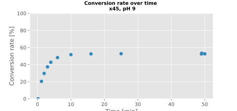
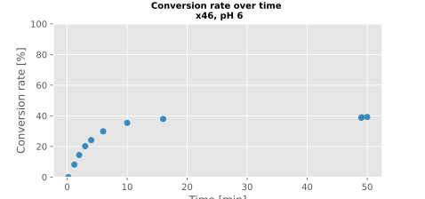

- check #phmeter
	- identify #stock-ph-calibration-solutions
		-
- measure pH of #x39
	- 5.07 @ 37.8°C
- measure pH of #x30
	- 7.30 @ 37.4°C
	- 7.34 @ 38.1°C
- create #x43:
	- reuse #x39 in its falcon tube; contains approx 2 mL of pH 5 solution
	- add 1000 uL of #x30
	- pH 6.13 @ 35.8°C
- prepare #x44:
	- fresh 15 mL falcon tube
	- add  1 mL of #x40 into
	- add 1.5 mL of #x30
	- pH 8.04 @ 34.0°C
	-
- measure remaining volume of #x21: 144 uL
	-
- prepare #x45, #x46, #x47:
	- #x45 : 500 uL #x40
	- #x46: 500 uL #x43
	- #x47: 500 uL #x44
	- start pre-heat in #thermomix at 12.54
	-
- #cary300-RTG12:
	- 2024-09-05-RTG12-air-1
	- -blank-water-2
	- -blank-x33-3
	- => shows difference from #x33 to pure water
	- TODO compare with water and x33 from previous campaigns!
	- -blank-water-4
	- there were 4 eppendorf tubes left, filled with x33 on 2024-09-01.
	- i pool 2 of those eppendorf tubes directly into the uv vis cuvette => -blank-x33-stored-5
	- => even bigger difference!
	- -blank-water-6
	- => looks okay, it does not seem to be the fault of the cuvette
	- pool the remaining 2 eppendorf tubes directly into the uv vis cuvette => -blank-x33-stored-7
	- => difference less than before, but still existent
	- =>=> it's not possible to reuse old sampling tubes
	- -blank-water-8
	- prepare all fresh sampling tubes with #x33
	- transfer #x33 from a freshly prepared sampling tube into cuvette => -blank-x33-from-tube-9
	- => looks the same like #x33 directly from bottle ; it is not the eppendorf tubes which are dirty
	- add 5 uL enz #x21 to top of the eppi, mix by inverting ; start at approx 13:23, with 20 seconds delay between eppis
	- timepoints:
		- t0 = 12 seconds
		- t1 = 1 min 12 seconds
		- t2 = 2 min
		- t3 = 3 min
		- t4 = 4 min
		- t5 = 6 min
		- t6 = 10 min
		- t7 = 16 min
		- t8 = 25 min
		- t9 + t10 = 49min + 49 min 5 seconds (sample immediately from the same epi after each other)
		- t11 = 50 min
	- - blank water rise up to 0.01AU over the course of the experiment -> discard the cuvette after this experiment!
	- 
	- 
	- 
	-
	- => => there seems to be a pH dependency of the equilibrium!