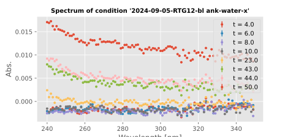

- start 8.00
- correct lab-data-metadata
- evaluation of #x29 after letting it sit on bench for 5 days (this is the measurement on 2024-09-01): => "yield" increased (from 54% to 66%) -- but this is probably due to decay of deoxyribose-1-phosphate (?) => metadata/\*RTG6*-extended
	- the fit plot looks very good
- evaluation of #x31 after letting it sit on bench for almost 5 days (this is the measurement on 2024-09-01): => "yield" only slightly changed (from 51.9% to 50.7%)
	- the fit plot looks okayish, but not great
- 08h40
- => strange that at pH 8 (#x29, buffered with Tris), the yield increases while it does not increase at pH 7.4 (#x31, buffered with mixture of buffer substances)
- 15h10
- start of evaluation of blanks -- metadata: 2024-09-14-cary300-retrospective-evaluation-of-blanks and -part2.csv
- => when measuring many samples after each other, there seems to be "build up of dirt", which is somewhat uniformly distributed added noise, up to 0.02 AU (little focus of dirt in lower wavelengths)
- 
	- this is 2024-09-05-RTG12, visualizing only the blank water entries. The time point is the number in the series of measurement, i.e. t=4.0 is the 4th time the cuvette is filled (from the same stock of blank water as all the other times) during this measurement series.
	- metadata file: 2024-09-14-cary300-retrospective-evaluation-of-blanks-part2-focus.csv
-