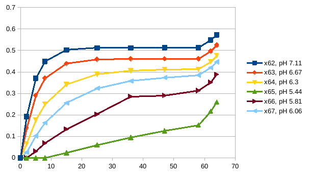
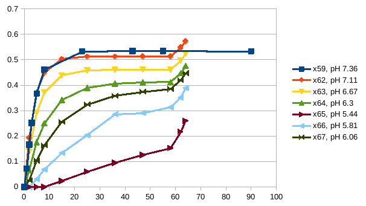
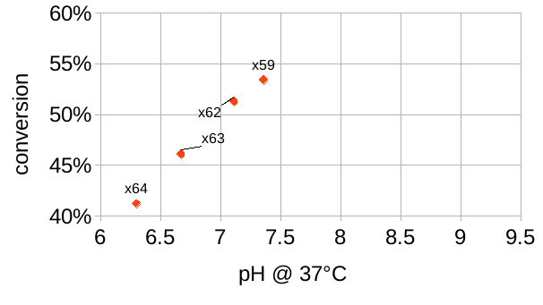

- 04:51 start working
- prepare metadata and overview files
- run data_toolbox
- 05:26
- look at RTG16
- 
- integrate RTG15 too:
- 
- => enzyme stayed active even at pH 5.44, but equilibrium was not reached.
- => Equilibrium might be assumed for pH 6.3 at approx 60 minutes, but equilibrium was definitely not reached at pH 6.06.
- evaluate the points for "reaching equilibrium" and "exclude poor spectra"
- 
-