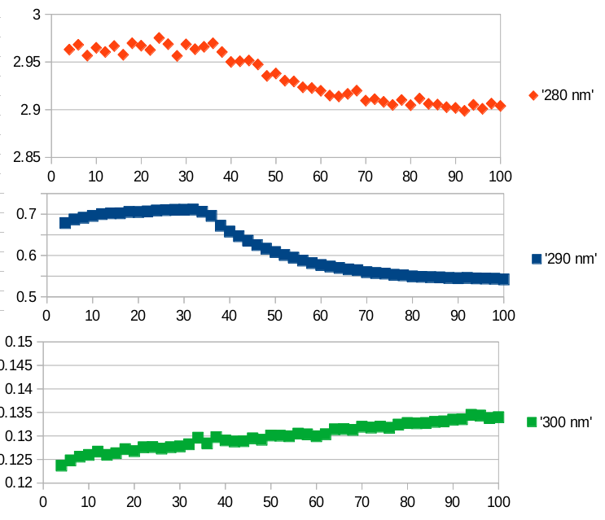
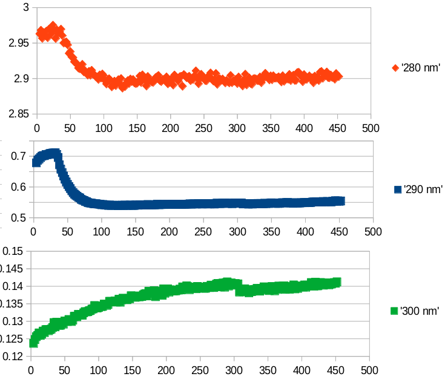

- 4h50: evaluate RTG17 / #x68
	- NB! These graphs do not show minutes on the x axis, but arbitrary numbers!
	- The total reaction time was 10h50 until 14h24, i.e. 214 minutes / approx 3.5 hours
	-
	- 
	- one unit on the x axis == .5 minutes
	- enzyme addition was between cycle 14/15 == x=32/34, this corresponds to the "action" seen in the 280/290nm trace
	- 
	- funny effects on the long time scale, too...
	- at minute 151/152 (x=307/308; 13h11), I believe I removed the cuvette from the machine to inspect it, and re-inserted it; this is probably seen in the 300nm trace.
- TODO: evaluate this pH (#x69, #x70, or #x71) indeed over the full time, i.e. 4 hours
	- => is the steady rise in signal only evaporation / cuvette effects?
- 5h23: end