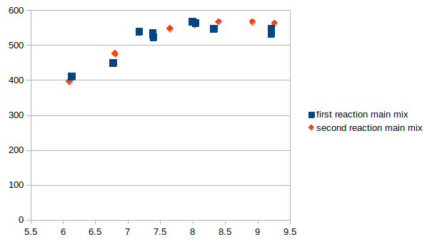

- 06h45 start to create metadata
- 07h50 calculating all spectra
- break
- 0810 visual check of all spectra
- 08h25 all fine; experiment was a success!
-
- approx 09h50 start of equilibrium results coll
- 
- 10:09  stop